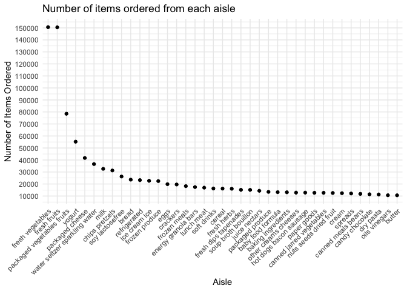

p8105\_hw3\_ah3108
================
Ava Hamilton
10/8/2019

# Problem 1

### Examining Instacart data

``` r
library(p8105.datasets)
data("instacart")

#The goal is to do some exploration of this dataset. To that end, write a short description of the dataset, noting the size and structure of the data, describing some key variables, and giving illstrative examples of observations. Then, do or answer the following (commenting on the results of each):

instacart = 
  instacart %>% 
  janitor::clean_names() %>% 
  mutate(
    # aisle = as.factor(aisle),
    department = as.factor(department)
  )


orderinfo = 
  instacart %>% 
  group_by(order_id) %>% 
  summarize(num_in_order = max(add_to_cart_order, na.rm = TRUE),
            num_reorders = sum(reordered, na.rm = TRUE),
            ratio_reorder = num_reorders/num_in_order) %>% 
  ungroup() %>% 
  view()
```

The *instacart* data has 15 variables and 1384617 observations, where
each observation is a product ordered on the online grocery service,
Instacart. The data contains 131209 orders from 131209 shoppers. The
median number of items ordered was 9, and ranged from 1 to 80 items with
an average 60.25% reordered
items.

``` r
# Part A - How many aisles are there, and which aisles are the most items ordered from?

items = 
  instacart %>% 
  add_count(aisle, sort = TRUE, name = "items_from_aisle")  %>% 
  distinct(aisle, items_from_aisle) %>% 
  arrange(desc(items_from_aisle))
```

There are 134 aisles, with the maximum number of items ordered from the
fresh vegetables aisle (N = 150609) followed by fresh fruits, packaged
vegetables fruits, yogurt, and packaged
cheese.

``` r
# Part B - plot of number of items ordered in each aisle, limiting this to aisles with more than 10000 items ordered.

items %>% 
  filter(items_from_aisle > 10000) %>%
  ggplot(aes(x = reorder(aisle, -items_from_aisle), y = items_from_aisle)) +
  geom_point() +
  scale_y_continuous(breaks = seq(10000, 150000, 10000)) + theme(axis.text.x = element_text(angle = 45, hjust = 1)) +
  labs(title = "Number of items ordered from each aisle",
       x = "Aisle",
       y = "Number of Items Ordered")
```


\# AVA COMMENT

``` r
# Part C 
#Make a table showing the three most popular items in each of the aisles “baking ingredients”, “dog food care”, and “packaged vegetables fruits”. Include the number of times each item is ordered in your table.

top_products = instacart %>% 
  filter(aisle %in% c("baking ingredients", "dog food care", "packaged vegetables fruits")) %>% 
  add_count(product_name, sort = TRUE, name = "items_in_aisle")  %>% 
  distinct(aisle, product_name, items_in_aisle) %>% 
  group_by(aisle) %>% 
  mutate(
    rank_product = rank(-items_in_aisle)
  ) %>% 
  filter(rank_product <= 3) %>% 
  dplyr::select(rank_product, everything()) %>% 
  kableExtra::kable()

top_products
```

<table>

<thead>

<tr>

<th style="text-align:right;">

rank\_product

</th>

<th style="text-align:left;">

aisle

</th>

<th style="text-align:left;">

product\_name

</th>

<th style="text-align:right;">

items\_in\_aisle

</th>

</tr>

</thead>

<tbody>

<tr>

<td style="text-align:right;">

1

</td>

<td style="text-align:left;">

packaged vegetables fruits

</td>

<td style="text-align:left;">

Organic Baby Spinach

</td>

<td style="text-align:right;">

9784

</td>

</tr>

<tr>

<td style="text-align:right;">

2

</td>

<td style="text-align:left;">

packaged vegetables fruits

</td>

<td style="text-align:left;">

Organic Raspberries

</td>

<td style="text-align:right;">

5546

</td>

</tr>

<tr>

<td style="text-align:right;">

3

</td>

<td style="text-align:left;">

packaged vegetables fruits

</td>

<td style="text-align:left;">

Organic Blueberries

</td>

<td style="text-align:right;">

4966

</td>

</tr>

<tr>

<td style="text-align:right;">

1

</td>

<td style="text-align:left;">

baking ingredients

</td>

<td style="text-align:left;">

Light Brown Sugar

</td>

<td style="text-align:right;">

499

</td>

</tr>

<tr>

<td style="text-align:right;">

2

</td>

<td style="text-align:left;">

baking ingredients

</td>

<td style="text-align:left;">

Pure Baking Soda

</td>

<td style="text-align:right;">

387

</td>

</tr>

<tr>

<td style="text-align:right;">

3

</td>

<td style="text-align:left;">

baking ingredients

</td>

<td style="text-align:left;">

Cane Sugar

</td>

<td style="text-align:right;">

336

</td>

</tr>

<tr>

<td style="text-align:right;">

1

</td>

<td style="text-align:left;">

dog food care

</td>

<td style="text-align:left;">

Snack Sticks Chicken & Rice Recipe Dog Treats

</td>

<td style="text-align:right;">

30

</td>

</tr>

<tr>

<td style="text-align:right;">

2

</td>

<td style="text-align:left;">

dog food care

</td>

<td style="text-align:left;">

Organix Chicken & Brown Rice Recipe

</td>

<td style="text-align:right;">

28

</td>

</tr>

<tr>

<td style="text-align:right;">

3

</td>

<td style="text-align:left;">

dog food care

</td>

<td style="text-align:left;">

Small Dog Biscuits

</td>

<td style="text-align:right;">

26

</td>

</tr>

</tbody>

</table>

``` r
# product_table = pivot_wider(top_products,
#                            names_from = aisle,
#                            values_from = c(product_name, items_in_aisle)
#) %>% 
#  kableExtra::kable() 
```

# AVA COMMENT

``` r
# Part D:
#Make a table showing the mean hour of the day at which Pink Lady Apples and Coffee Ice Cream are ordered on each day of the week; format this table for human readers (i.e. produce a 2 x 7 table).
```

# AVA COMMENT
